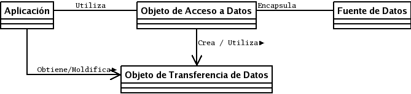

+++
title = "El patrón de acceso a datos (DAO)"
slug = "20060702185110418"
date = "2006-07-02T18:51:00-06:00"
[taxonomies]
tema = ["articulos"]
autor = ["Víctor Manuel Jáquez Leal"]
+++

En la pasada discusión sobre el diferencial de impedancia entre el mundo
relacional y el de la orientación a objetos [1] y sobre las distintas soluciones
que se han propuesto. En esta ocasión quisiera abundar en una de las soluciones:
el patrón DAO [2].

Digamos, sucintamente, que un patrón de diseño de software es una abstracción de
solución a un problema genérico y común en el diseño de software [3].
Normalmente los patrones están especificados en gráficos de UML y utilizan la
semántica de la orientación a objetos.

Específicamente, el patrón DAO (Data Access Object) es una solución al problema
del diferencial de impedancia entre un programa de aplicación orientado a
objetos y una base de datos relacional, empleando únicamente la interfaz de
programación (API) nativa del manejador de base de datos, o algún otro sustituto
como el ODBC, DBI, etcétera.

<!-- more -->
Debido a que Sun adoptó al patrón DAO como parte de su catálogo de patrones para
J2EE [4], es generalizada la idea de que el patrón sólo es aplicable dentro del
lenguaje Java, pero esto no es así, cualquier patrón es adaptable a
prácticamente cualquier lenguaje de programación.



El gráfico anterior representa el diagrama de clases del patrón DAO. La primer
clase que se observa es Aplicación, que es la clase cliente que necesita los
datos almacenados en la fuente de datos para lograr su objetivo. Hay que hacer
notar que ésta no le pide los datos directamente a la fuente de datos, sino que
lo hace a través de un tercer objeto (el de acceso a datos), utilizando un
cuarto objeto (el de transporte de datos) quien almacenará todos los datos que
intercambiarán la aplicación con la fuente datos.

Luego está el Objeto de Acceso a datos, quien se encargará de conectarse
directamente con la fuente de datos utilizando su API nativa y ejecutará las
transacciones necesarias sobre ella. Por ejemplo, si la operación es una
consulta, el objeto hará la transacción indicada y devolverá a la aplicación un
conjunto de objetos de transporte de datos conteniendo el resultado; por otro
lado, si la transacción es una inserción, entonces la aplicación pasará como
parámetro un objeto de transporte de datos que será almacenada en la fuente de
datos, y así con las demás tareas como borrado y actualización.

Está el ya mencionado Objeto de Transferencia de Datos que encapsula todos los
datos que contiene operación sobre la fuente de datos. Podemos pensar en ella
como la representación de una tupla de una tabla en una base de datos
relacional.

Por último está la fuente de datos en sí, quien almacena los datos con los que
se va a trabajar. Puede ser la interfaz de programación de un manejador de base
datos, de un servidor de LDAP, de un servicio Web de datos, etcétera.

El propósito del patrón DAO es, en pocas palabras, abstraer y encapsular todos
los accesos a la fuente de datos. Con esto se obtiene varias ventajas: 1) se
tiene un paliativo al problema del diferencial de impedancia (transparencia); 2)
se baja en nivel de acoplamiento entre clases, reduciendo la complejidad de
realizar cambios; y 3) se aísla las conexiones a la fuente de datos en una capa
fácilmente identificable y mantenible.

Para hacerlo aún más claro, expongamos un ejemplo muy sencillo en C++ con
PostgreSQL utilizando libpq [5].

Supongamos que tenemos la tabla ciudad con este esquema:

```{sql}
CREATE TABLE ciudades (
  nombre         varchar(80),
  estado       varchar(80)
);
```

Entonces ahora tenemos que crear 2 clases por cada relación con la que nuestra
aplicación tendrá acceso: el acceso a datos y el transporte de datos. Expongamos
primero la especificación de la clase de transporte de datos:

```{C++}
class Ciudades {
  private:
    string nombre;
    string estado;
  public:
    // Constructor sin parámetros
    Ciudades ();

    // Constructor parametrizado
    Ciudades (const string nombre, const string estado);

    // métodos getters y setters de atributos
    void setNombre (string nombre);
    string getNombre () const;
    void setEstado (string estado);
    string getEstado () const;
}
```

La implementación de esta clase es trivial y podrá imaginarse fácilmente. Ahora
veamos la definición de la clase de acceso a datos:

```{C++}
class CiudadesDAO {
  private:
    PGconn *pgconn;
  public:
    // Constructor
    // @param pgconn conexión a la base de datos
    CiudadesDAO (PGconn *pgconn) throw (string);

    // Agrega una tupla en la tabla
    void insert (const Ciudades ciudad) throw (string);

    // Encuentra una tupla específica en la tabla
    Ciudades find (const string nombre) throw (string);

    // Borra una tupla específica
    void delete (const string nombre) throw (string);

    // Encuentra una lista ciudades dado un criterio
    list<Ciudades> select (const string criteria) throw (string);}
```

Veamos, con el fin de ilustrar, la implementación del método `find`:

```{C++}
Ciudades CiudadesDAO::find (string nombre)
{
  PGresult *res;
  const char *paramValues[1];
  string sql = "SELECT * FROM ciudades WHERE nombre = $1::VARCHAR(80)";
  string err;
  int nombrenum, estadonum;
  Ciudades ciudad;

  if (this->pgconn == NULL)
    throw ("No existe conexión con la fuente de datos.");
  paramValues[0] = nombre.c_str();
  res = PQexecParams(this->pgconn,sql, 1, NULL, paramValues, NULL, NULL, 0);
  if (PQresultStatus(res) != PGRES_TUPLES_OK) {
    err = "Failed query: " + sql;
    err = err + " Reason: " + PQerrorMessage(this->pgconn);
    PQclear (res);
    throw (err)
  }
  nombrenum = PQfnumber (res, "nombre");
  estadonum = PQfnumber (res, "estado");

  // Si regresa NULL, regresa una ciudad vacía
  if (PQntuples(res) == 0)
    return ciudad;

  ciudad.setNombre (PQgetvalue(res, 0, nombrenum));
  ciudad.setEstado (PQgetvalue(res, 0, estadonum));
  return ciudad;}
```

En esta implementación se observa una forma de lanzar las consultas al
PostgreSQL, utilizando la función PQexecParams. Esta función ejecuta consultas
parametrizadas y prácticamente la API de cualquier DBMS ofrece este tipo de
funciones, las cuales evitan grandes problemas de seguridad, tal como la
inyección de código SQL y la correcta conversión del tipo de dato de parámetros
y resultados.

Para redondear escribamos una sencilla función donde se empleen estas dos
clases:

```{C++}
void getCelaya (PGconn *conn)
{
  try {
    CiudadesDAO celayadao(conn);
    Ciudades celaya = celayadao.find("celaya");
  } catch (string err) {
    cerr << err << endl;
    return;
  }
  cout << "Celaya está en el estado de " << celaya.getEstado() << endl;}
```

Sin embargo, las aplicaciones del mundo real no están compuestas por el acceso a
una simple tabla, una aplicación común y correctamente normalizada estaría
expuesta a docenas de relaciones, o hasta cientos si la cosa es más grande. Para
enfrentar esta situación se utiliza el patrón Factory para implementar una
fábrica de objetos DAO. Por otro lado, normalmente buscaremos dar a cada
instancia de la aplicación una y sólo una conexión a la base de datos, por lo
tanto esta factoría, si se encarga de realizar la conexión, deberá también
cumplir con el patrón *Singleton*, que satisface esta expectativa. Mi tiempo ya
es corto para seguir alargándome en este comentario y dejaré de tarea a los
curiosos que investiguen por su cuenta cómo se elaboraría y trabajaría con esta
clase.

Sin embargo, todos somos perezosos y buscamos escribir la menor cantidad de
código posible, y la sola idea de escribir dos clases por cada relación a
acceder desde nuestra aplicación es para abrumar a cualquiera. Pero si somos
observadores notaremos que es posible automatizar la creación de estas clases a
partir del mismo esquema dela base de datos, o una descripción en algún otro
formato como XML.

Muchas gracias por su atención.

Bibliografía

1. <http://www.glib.org.mx/article.php?story=20060611151541892>
2. <http://java.sun.com/blueprints/corej2eepatterns/Patterns/DataAccessObject.html>
3. <http://en.wikipedia.org/wiki/Software_pattern>
4. <http://java.sun.com/blueprints/corej2eepatterns/Patterns/index.html>
5. <http://www.postgresql.org/docs/8.1/interactive/libpq.html>
