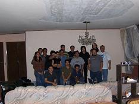

+++
title = "Bitácora de la reunión en Celaya"
slug = "20060710110311281"
date = "2006-07-10T11:03:11-06:00"
[taxonomies]
tema = ["glib"]
autor = ["Luis Rey Lara"]
+++

Estas son las fotos y la bitácora de la pasada reunión en Celaya.

Nuestra hermosa anfitriona, Tulsipop, me abrió la puerta y todo estaba
listo para recibir a nuestros asistentes.

Eran las 4:30 pm y sólo estábamos 4 personas (Tulsipop, Nexos, Juan Espinal
y Bebeboy) y pensé "otra reunión con pocos participantes".

Pero mi sorpresa fue que después de 10 minutos llegaron "todos". ¡Un total
de 18 participantes!.

Continúa…

<!-- more -->
Los participantes fueron:

Sergio Vázquez Ramírez—-Irapuato Erick Herrera Palmerín——–Estado de México.
Juan Espinal Dueñas——–Irapuato Moisés Quezada————–Irapuato Aldo Hugo
Vargas Rodríguez –Salamanca Jacob Israel Cervantes L.—Irapuato Juana
Magally López——-Irapuato Roberto González Oseguera–Irapuato Mauricio
Enrique Ruíz——-Guanajuato Álvaro Silva Caballero ——Celaya Gustavo
Castillo Loma——Salamanca Fernando Medina Navarrete —Irapuato José Ramón
Pérez V. —Irapuato Tulsipop Sahib—————–Celaya Juan Caballero————-Irapuato
José Edgar—————–Irapuato Mireya V.M. ————–Irapuato Luis Rey
Lara————-Celaya

De un total 18 Participantes:

11 participantes de Irapuato (61%) 3 participantes de Celaya (17%) 1
participante del Estado de México (6%) 2 participantes de Salamanca (11%) 1
participante de Guanajuato (6%).

Lo bueno: cabe destacar la proactiva participación de los visitantes de
Irapuato, les agradezco su visita.

Lo Malo: Poca participación de Celaya, debemos de trabajar más en la
difusión de las reuniones.

Ahora les platico como se desarrolló la reunión.

4:30 pm: Luis Rey Lara (Bebeboy) (el burro por delante) di la
bienvenida, procedimos a presentarnos y a iniciar la charla de "Proyecto
CDLibre".

5:10 pm: Juan Caballero (Linxe) nos dio su charla de LiveCD’s con un
retoque para enseñarnos a crear los nuestros.

6:00 pm: Pasamos a degustar los ricos tacos sudados, refrescos,
cervezas, patitas de puerco y conocer el comedor de la casa de Tulsipop.

7:00 pm: Jacob Israel (Jacob) nos dio una cátedra de "mame" y nos
presumió su libro "Mame for dummies".

8:00 pm: José Edgar (Silex): una plática introductoria-avanzada de
"Blender-GIMP", quedamos muy entusiasmados con esta charla que deseamos
iniciar lo más pronto posible un curso de introducción de Blender y de
Gimp.

9:30 pm: Charla de Erick del sistema que utilizan en el DIF del D.F. en
el cual utilizan el Python y el PostgreSQL.

10:30 pm: Dimos por terminada la reunión y nos despedimos.

algunas fotos las puedes ver en:

<http://wiki.glib.org.mx/index.php/GLIB_a_trav%C3%A9s_de_los_a%C3%B1os#Reuni.C3.B3n_de_Julio_2006">

Es muy interesante saber que tienes la posibilidad de encontrar a
contactos, amigos, personas afines a tus pasatiempos etc.

Me gustaría saber tu opinión, tu punto de vista, ¿te gustó?, ¿esperabas
más?, ¿que cambiarías?, etc.

Algunos participantes nos dieron algunas sugerencias muy importantes, ya
tomé nota y estamos en la etapa de implementarlas.

Deseo mejorar las reuniones, entonces empezamos a planear la de Irapuato
(Agosto 12).

¿Hecho?
