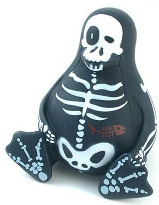
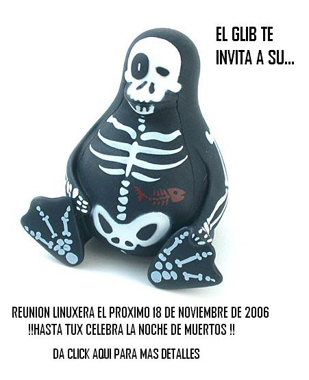

+++
title = "Día de Muertos"
slug = "20061025153044665"
date = "2006-10-25T15:30:00-06:00"
[taxonomies]
tema = ["glib"]
autor = ["jacob israel cervantes luevano"]
+++

En Noviembre GLiB pone a prueba tu creatividad

El día de muertos está próximo, es por ello que GLiB invita a todos los
usuarios a participar en el gran concurso de elaboración de calaveras, a
continuación se muestran las bases del evento:

<!-- more -->
TEMÁTICA: El tema para la elaboración de calaveras será con referencia a
la informática (Calaveras que no contenga la temática no participarán).

FECHAS: Las calaveras se podrán enviar a partir del 25 de octubre y el límite de
recepción será el 1° del noviembre de este año. (Calaveras enviadas fuera de los
límites establecidos quedarán descalificadas).

PREMIOS:

1. lugar: 2 pases para el cine y una mini-torre discos vírgenes.
2. lugar: una mini-torre discos vírgenes.
3. lugar: una caja de chocolates.

La elección de la calaveras ganadoras se determinará el 2 de noviembre
de este año, tomando en cuenta las bases del evento, creatividad,
originalidad y rima.

Las calaveras ganadoras serán publicadas en la página de GLiB y el
premio se entregará el 11 de noviembre, que corresponde a la reunión del
mes del grupo.

Participen y fomentemos nuestras hermosas tradiciones.
