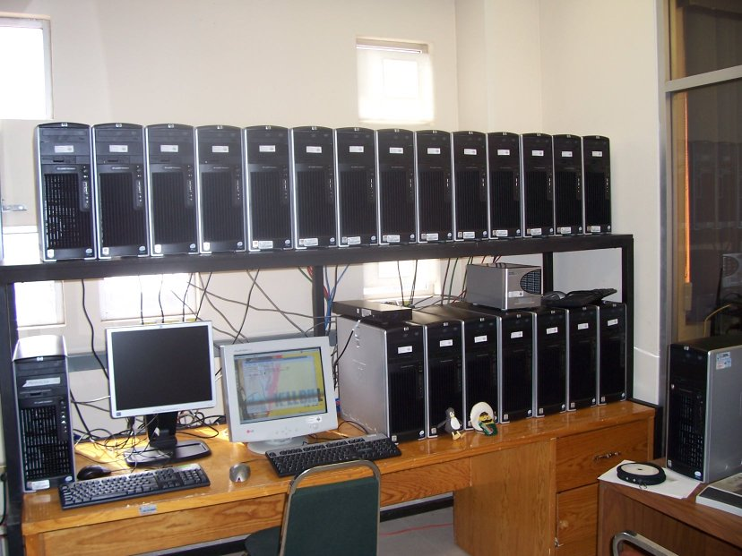

+++
title = "Linux clústers - Parte 2/3"
slug = "20070613161352667"
date = "2007-06-13T16:13:00-06:00"
[taxonomies]
tema = ["articulos"]
autor = ["Juan Caballero"]
+++

Esta es la segunda parte del montaje y uso de un clúster basado en Linux. En
está ocasión se tratará sobre los detalles de la instalación de un sistema
homogéneo completo con [ROCKS](http://www.rocksclusters.org/). Una disculpa a
quienes han estado ansiosos con esta continuación, ya que no había tenido tiempo
de prepararla.

*Continúa ... Actualizado con fotos ....*

<!-- more -->
Para recordar en que nos quedamos respecto al [artículo
anterior](http://www.glib.org.mx/article.php?story=20070320133500387), ya
contamos con los equipos y se había armado una red pequeña donde el nodo maestro
posee 2 tarjetas de red, con la eth0 se comunica con los nodos a través de un
*switch* de 24 puertos 10/100, y con la eth1 se comunica con la
intranet/internet.

Primero veamos porque se escogió a ROCKS como distribución, dado que tenía
varias alternativas como Beowulf, Oscar, Mosix, etc.

Basado en [CentOS](http://www.centos.org/), que está basado en el muy conocido
[RedHat](http://www.redhat.com/), esto a mí me dio confianza y ya tengo
experiencia previa con estos sistemas mediante
[Fedora](http://fedoraproject.org/).

La configuración y administración está montada en bases de datos en MySQL.

Sistema integral que incluye todo lo necesario para instalar e usar de
inmediato.

Sistema de módulos de expansión con aplicaciones específicas, en mi caso, uno
específico para bio-informática ya listo con muchos programas de uso estándar.

Sistema de monitorizado y mantenimiento incluido y automatizado.

Muchas herramientas de desarrollo incluidas y específicas de súper-cómputo.

Totalmente escalable a nivel de equipo.

Todas las ventajas de la GPL/GNU.

## Requerimientos mínimos

* Procesador x86, x86_64, IA-64
* Redes: Ethernet, Myrinet, InfiniBand
* Disco duro: 20 GB
* Memoria RAM: 640 MB

## Paso 1. Obtener la distribución

En la sección de [Downloads](http://www.rocksclusters.org/wordpress/?page_id=3)
podemos descargar la imágenes ISO necesarias, ahí están catalogadas de acuerdo a
la arquitectura del procesador, descarguen las correspondientes y verifiquen las
MD5 antes de grabar los discos. Los discos requeridos son:

* Kernel/Boot Roll (el de arranque)
* Core Roll (sistema base)
* Service Pack Roll (actualizaciones de seguridad)
* OS Roll Disc 1 (sistema operativo)
* OS Roll Disc 2 (sistema operativo)

Los opcionales que son para ampliar su clúster:

* apbs (Adaptive Poisson-Boltzmann Solver)
* area51 (System security related services and utilities)
* bio (Bioinformatics utilities)
* condor (High throughput computing tools)
* Ganglia (Cluster monitoring system from UCB)
* grid (Globus 4.0.2 GT4)
* Java (Sun Java SDK and JVM)
* pbs (Portable Batch System)
* pvfs2 (PVFS2 File System)
* sge (Sun Grid Engine job queueing system)
* silverstorm-qlogic-ib (SilverStorm-Qlogic IB Roll)
* topspin-ib (Topspin’s IB stack packaged by Cluster Corp.)
* viz (Support for building visualization clusters)

voltaire-ib (InfiniBand support for Voltaire’s IB hardware) ya viene incluido en
el Core Roll.

En mi caso sólo descargué los requeridos más el bio.

## Paso 2. Instalar el nodo maestro

Coloque el disco Kernel/Boot Roll y arranque su computador, en cuanto tenga la
pantalla con boot: escriba `frontend`

En cuanto termina el arranque se dan de alta los discos con los que se cuenta,
simplemente presionen el botón de CD/DVD-based Roll e inserten uno a uno los
discos. También es posible instalar vía red, pero sólo es recomendable si tienen
banda ancha, ya que van a descargar al menos los discos base. Después se les
pide información sobre el clúster, cosas típicas, por ejemplo el nuestro quedó
así:

```bash
Fully-Qualified Host Name: blackmamba.ira.cinvestav.mx
Cluster Name: blackmamba
Certificate Organization: CINVESTAV
Certificate Locality: Irapuato
Certificate State: Guanajuato
Certificate Country: MX
Contact: ******@ira.cinvestav.mx
URL: <http://blackmamba.ira.cinvestav.mx/>
Latitude/Longitude: N20.40/W101.20
```

Salvo que su clúster tenga salida directa a internet, las direcciones de Host
Name y URL pueden no ser válidas.

En seguida se da de alta la red, obligadamente eth0 es la que se comunica con
los nodos esclavos, y eth1 con el exterior. Tengan cuidado de no causar
colisiones en su red o colocar invertidas las tarjetas, además la IP pública de
preferencia que sea estática. En esos casos pueden modificar las opciones que
vienen por defecto y adecuarlos a su red.

Los demás datos son sobre la contraseña de administrador (root) y la zona
horaria, las particiones que pueden hacerse en automático, coloca así las
particiones:

```bash
/ 8 GB
/var 4 GB
swap 1 GB
/export el resto del disco
```

Pueden adecuar un poco más esta distribución, en mi caso como el disco duro es
de 150 GB, opte por no moverle.

## Paso 3. Instalar los nodos esclavos

Ingresen al nodo maestro como root e invoquen: `insert-ethers`

Aquí seleccionen `Compute` y esperen al modo de escucha.

Para facilitarse la vida, usen el arranque vía red en todos sus nodos esclavos,
aunque esto sólo es válido si es un clúster homogéneo. Si no lo es, inserten el
disco de Kernel/Boot adecuado para cada nodo y no le den parámetros de
arranque. Ahora enciendan uno a uno los nodos esclavos, dando tiempo al sistema
de detectarlos, cuidado que pueden sobrecargar al maestro o al switch, ya que en
este punto cada nodo arranca y descarga una imagen preparada por el maestro.

Uno a uno los nodos son detectados e instalados, ya no hace falta hacer nada,
automáticamente se instalan y se dan de alta.

## Paso 4. Dar de alta usuarios

Basta con como administrador hacer: `useradd usuariorocks-user-syncpasswd
usuario`

## Paso 5. Personalizar aplicaciones

En general la mayoría de las aplicaciones son exportadas a todos lo nodos, pero
la carpeta `/export` que es donde esta realmente `/home` se migra a todos lo
nodos, en mi caso mis usuarios usan los programas del paquete *bio* y éste está
migrado en `/export/bio`, pero pueden hacer que sus programas migren fácilmente
ubicándolos en una carpeta en su `HOME`, por ejemplo `\~/mybin` y añadirla a su
`PATH`, o crear una carpeta especial para eso.

Para probar pueden consultar sus nodos con: `cluster-fork hostname`

El monitorizado pueden acceder por `SSH`` y se ha montado un servidor web donde
pueden ver la actividad con Ganglia, consultar la documentación o modificar la
base de datos con PHPAdmin, e incluso generar una plantilla de etiquetas para
cada nodo y así rápidamente identificarlos. Para apagar el sistema deben apagar
primero los nodos esclavos y luego el maestro, la forma fácil es como root:

```bash
cluster-fork shutdown -h now
shutdown -h now
```

El arranque es primero el nodo maestro, esperar a que termine y luego uno a uno
los esclavos. Finalmente pueden probar aplicaciones ya preparadas para
clusterización con MPI o MPICH, o usar procesos distribuidos con el SGE. En la
tercera y última parte veremos la programación básica con MPI y uso del sistema
de colas de trabajo.




Autor: Juan Caballero (linxe (arroba) glib . org . mx)
